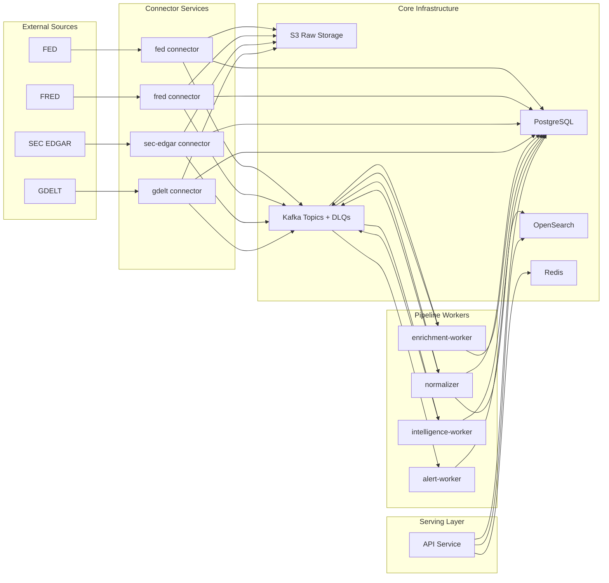

# Market Intelligence Platform Architecture

This document describes the current architecture of the Market Intelligence Platform and how data moves from source ingestion to API delivery and alerting.

## Architecture Diagram

## 1. System Goals

- Ingest public market-relevant content from multiple sources.
- Normalize and enrich documents into structured signals.
- Preserve provenance and tenant isolation across all pipeline stages.
- Expose search, analytics, and alerting via API.

## 2. High-Level Topology

The platform is organized as a monorepo with three major layers:

- `services/`: asynchronous workers and source connectors
- `apps/`: API and user-facing worker processes
- `packages/`: shared libraries for schemas, persistence, messaging, observability, and policy logic

Core infrastructure:

- Kafka for event backbone and decoupled processing
- PostgreSQL for operational persistence
- S3-compatible object storage for immutable raw payloads
- OpenSearch for retrieval/search
- Redis for distributed API rate limiting

## 3. Data Flow

### 3.1 Ingestion

1. Connector discovers source items (FED, FRED, SEC EDGAR, GDELT).
2. Connector fetches content and computes deterministic ingestion identifiers.
3. Raw payload is stored in object storage and persisted in `raw_documents`.
4. Connector publishes `raw.document.ingested` event to Kafka.

Key properties:

- Checkpoint progression is tied to successful publish completion.
- Duplicate raw records are republished downstream to recover from prior partial failures.
- Connector runners require explicit tenant context at execution time.

### 3.2 Normalization

1. Normalizer consumes raw document events.
2. Content is parsed into canonical normalized shape.
3. Deduplication checks run (exact hash and near-duplicate).
4. Canonical/duplicate lineage is persisted in PostgreSQL.
5. Canonical document is indexed in OpenSearch.
6. Normalized and enrichment-request events are published.

Key property:

- Idempotent replay: if a document already exists by deterministic identifier, processing exits early to prevent duplicate downstream side effects.

### 3.3 Enrichment

1. Enrichment worker consumes normalization output.
2. Rule-based extraction creates entities, events, and evidence spans.
3. Deterministic IDs are used for replay-safe writes.
4. Extracted payloads are published for intelligence processing.

### 3.4 Intelligence and Alerts

1. Intelligence worker consumes extracted events.
2. Narrative updates and signal generation run.
3. Alert candidate events are produced.
4. Alert worker evaluates rules and executes channel delivery (email/webhook).

Key properties:

- Tenant ID is required in event payloads for multi-tenant isolation.
- Delivery records use deterministic IDs for idempotent retries.
- Delivery failures are retried and can route through DLQ behavior at consumer boundaries.

## 4. Serving Layer

The API (`apps/api`) provides:

- document/entity/event/narrative/signal access
- alert rule lifecycle management
- hybrid search over indexed data

Current search behavior:

- search is restricted to document index paths that are currently populated
- event/narrative retrieval remains available through domain APIs backed by database repositories

## 5. Security and Policy Controls

- API key authentication with role-based authorization.
- Redis-backed distributed rate limiting.
- Explicit development auth bypass gate (`ALLOW_DEV_AUTH`).
- Licence-aware response filtering before serving text.
- Webhook SSRF safeguards:
  - strict scheme checks
  - hostname allowlist in non-development environments
  - private/link-local/loopback address rejection
  - redirect following disabled in delivery worker

## 6. Reliability and Idempotency Patterns

- Deterministic UUID generation for documents, mentions, events, signals, and deliveries.
- Duplicate-safe persistence checks before inserts.
- Kafka DLQ integration in workers for terminal handler failures.
- Connector checkpoint updates only after successful completion semantics.

## 7. Repository-Level Architecture Map

- `apps/api`: REST API, auth, search, policy-aware response shaping
- `apps/alert-worker`: alert dispatch and channel delivery execution
- `services/connectors/*`: source-specific discovery/fetch logic
- `services/normalizer`: raw-to-canonical parsing, dedup, indexing trigger
- `services/enrichment-worker`: extraction and evidence generation
- `services/intelligence-worker`: narrative/signal generation and alert candidate emission
- `packages/database`: models, sessions, repositories, migrations
- `packages/messaging`: Kafka consumer/producer wrappers and payload contracts
- `packages/source-licensing`: content serving policy enforcement
- `docs/decisions`: architecture decision records (ADRs)

## 8. Cross-References

- ADR-001: Monorepo Structure
- ADR-002: Kafka Event Backbone
- ADR-003: PostgreSQL Operational Store
- ADR-004: Hybrid Search
- ADR-005: Immutable Raw Storage
- ADR-006: Evidence-First Extraction
- ADR-007: Centralized Model Gateway
- ADR-008: Versioned Schemas
- ADR-009: Transparent Signals
- ADR-010: Licence-Aware Serving
